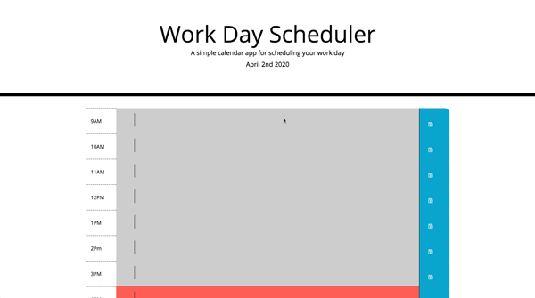

<h1 align='center'>DayPlanDreamer</h1>

UofT SCS Coding Bootcamp | Lesson 05

# User Story

Poor time management can result in missed meetings and deadlines or create the appearance of unprofessionalism. A daily planner allows employees to see their day at a glance, schedule time effectively, and improve productivity. 

AS AN employee with a busy schedule

I WANT to add important events to a daily planner

SO THAT I can manage my time effectively 

# User Directions

The user simply chooses which time block they wish to plan an event and then click save icon to save the event.

# Overview

DayPlanDreamer is a simple calendar application that allows the user to save events for each hour of the day. This app will run in the browser and feature dynamically updated HTML and CSS powered by jQuery.The [Moment.js](https://momentjs.com/) library 

# Deployment Links

https://joshfrechette.github.io/DayPlanDreamer/

https://github.com/JoshFrechette/DayPlanDreamer.git

# Preview

# Portfolio

https://joshfdesign-react-portfolio.herokuapp.com/

# License

MIT License

Copyright (c) 2019 Josh Fréchette

Permission is hereby granted, free of charge, to any person obtaining a copy of this software and associated documentation files (the "Software"), to deal in the Software without restriction, including without limitation the rights to use, copy, modify, merge, publish, distribute, sublicense, and/or sell copies of the Software, and to permit persons to whom the Software is furnished to do so, subject to the following conditions:

The above copyright notice and this permission notice shall be included in all copies or substantial portions of the Software.

THE SOFTWARE IS PROVIDED "AS IS", WITHOUT WARRANTY OF ANY KIND, EXPRESS OR IMPLIED, INCLUDING BUT NOT LIMITED TO THE WARRANTIES OF MERCHANTABILITY, FITNESS FOR A PARTICULAR PURPOSE AND NONINFRINGEMENT. IN NO EVENT SHALL THE AUTHORS OR COPYRIGHT HOLDERS BE LIABLE FOR ANY CLAIM, DAMAGES OR OTHER LIABILITY, WHETHER IN AN ACTION OF CONTRACT, TORT OR OTHERWISE, ARISING FROM, OUT OF OR IN CONNECTION WITH THE SOFTWARE OR THE USE OR OTHER DEALINGS IN THE SOFTWARE.